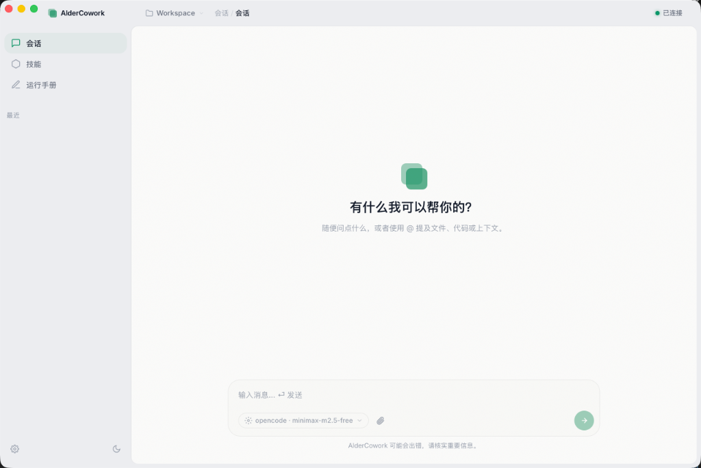

# AlderCowork

> **让 AI 成为你团队的标准工作方式**

基于 [OpenCode](https://github.com/anomalyco/opencode) 构建的桌面 AI 协作应用（支持 macOS 与 Windows）。面向普通用户和团队，将 AI 能力封装为可管理、可分发、可复用的 Skills，让 AI 和 Skill 生态面向组织易用化和标准化。

<p align="center">
  
</p>

---

## 解决什么问题？

| 痛点 | 现状 | AlderCowork 方案 |
|------|------|-----------------|
| **门槛高** | AI 编程助手面向开发者，普通用户难以使用 | 桌面端 + 自然对话，零学习成本 |
| **碎片化** | 每人各用各的 AI 工具，能力参差不齐 | 统一桌面端 + Skill 分发，团队能力对齐 |
| **不可治理** | Prompt 散落各处，无法标准化 | Skills = 可执行的团队知识资产 |

---

## 核心能力

### 💬 智能对话

- 支持主流 LLM 提供商（OpenAI、Anthropic、Google 等）
- SSE 流式响应，实时推理过程可视化
- 多会话管理，上下文保持

### 🧩 Skill 生态

Skills 不是 prompt 片段，而是**可执行的团队知识资产**。

- **安装 ≠ 激活** — 导入后按需激活到全局或工作区
- **双范围激活** — 通过 UI 双 Toggle 控制作用域
- **Monorepo 支持** — 一次导入递归发现所有子技能
- **多种导入** — 压缩包 (.zip / .tar.gz) 或 Git 仓库 URL

---

## 架构

```
┌─────────────────────────────────────────────────────┐
│  AlderCowork Desktop (Tauri v2 + WebView)           │
│  Vue 3 + TypeScript + CSS 设计系统                  │
│  Chat UI │ Skill Panel │ Runbooks │ Settings        │
└────────────────────────┬────────────────────────────┘
                         │ @opencode-ai/sdk (HTTP + SSE)
┌────────────────────────▼────────────────────────────┐
│  OpenCode Kernel (sidecar, headless mode)            │
│  LLM Providers │ Tools │ Skills │ Sessions          │
└─────────────────────────────────────────────────────┘
```

OpenCode 是可独立升级的 AI 内核，AlderCowork 是面向用户的外壳。不 Fork 内核，通过官方 SDK + Sidecar 集成。

---

## 技术栈

| 层 | 技术 |
|----|------|
| **Desktop** | Tauri v2 (Rust + WebView) |
| **前端** | Vue 3 + TypeScript + Vite + Pinia + Vue Router 4 |
| **样式** | CSS 变量设计系统，dark / light 双主题 |
| **SDK** | [`@opencode-ai/sdk`](https://www.npmjs.com/package/@opencode-ai/sdk) |
| **AI 内核** | [OpenCode](https://github.com/anomalyco/opencode) sidecar |
| **国际化** | 中 / 英双语 |

---

## 开发

```bash
pnpm install

# 桌面开发 (Tauri + Vite HMR)
cd apps/desktop && pnpm tauri:dev

# 仅前端开发
pnpm dev

# 类型检查
cd apps/desktop && npx vue-tsc --noEmit
```

<details>
<summary>📂 目录结构</summary>

```
aldercowork/
├── apps/desktop/              # Tauri + Vue 3 桌面应用
│   ├── src/                   # 前端源码
│   └── src-tauri/             # Rust 后端 (IPC + sidecar 生命周期)
├── packages/
│   └── skill-schema/          # skill.yaml 类型定义
└── docs/
    └── product-design.md      # 产品方案
```

</details>

---

## 致谢

本项目由 [**OpenCode**](https://github.com/anomalyco/opencode) 提供 AI 内核驱动。AlderCowork 通过官方 SDK 和 Sidecar 模式集成 OpenCode，复用其 LLM 编排、工具调用、Session 管理和 Skill 运行时能力。不 Fork、不魔改，与上游同步演进。

感谢 [Anomaly](https://github.com/anomalyco) 团队打造了如此出色的开源项目。

---

## License

[MIT](LICENSE)
